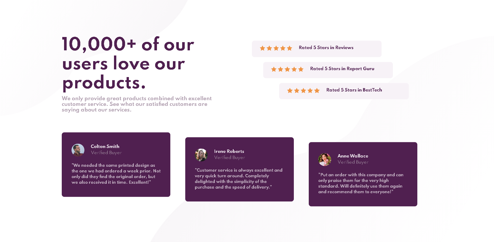
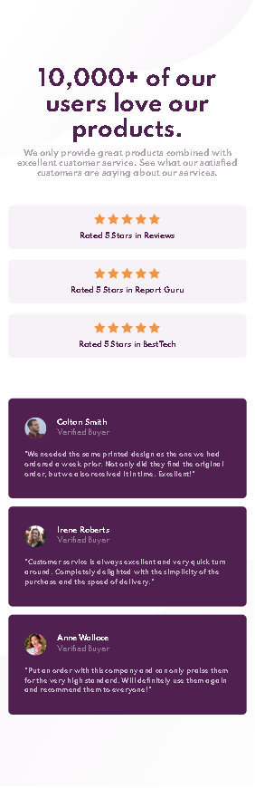

# Social Proof Section
This is a Challenge project from frontendmentor website
A Responsive Social Proof Section

## Table of contents

- [Overview](#overview)
  - [Screenshot](#screenshot)
  - [Links](#links)
- [My process](#my-process)
  - [Built with](#built-with)
- [Author](#author)

## Overview

### Screenshot

### Links

- Live Site URL: [GitHub Pages](https://frontendparham.github.io/social-proof-section/)

## My process

### Built with

- HTML
- CSS
- SASS
- Flexbox
- Responsive Design

## Author

- Parham Tavakolian
- Instagram - [@frontendparham](https://www.instagram.com/frontendparham)
- Frontend Mentor - [@frontendparham](https://www.frontendmentor.io/profile/frontendparham)
- GitHub - [@frontendparham](https://www.github.com/frontendparham)
